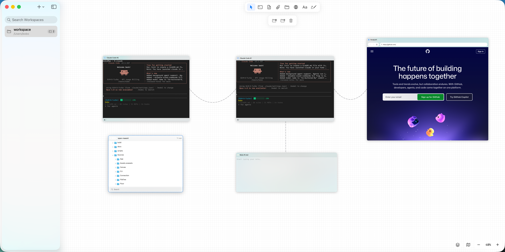
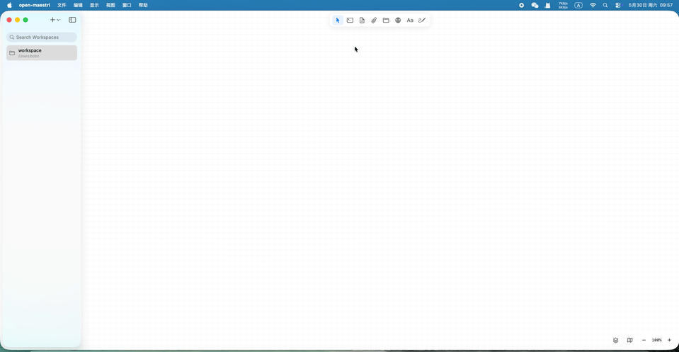
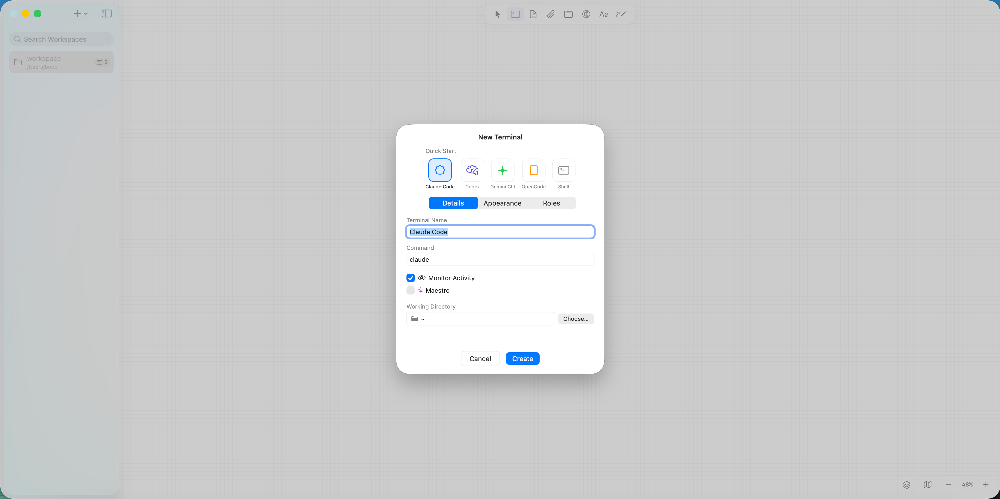
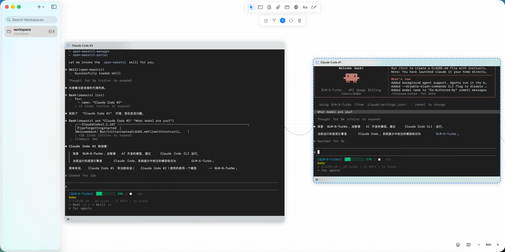
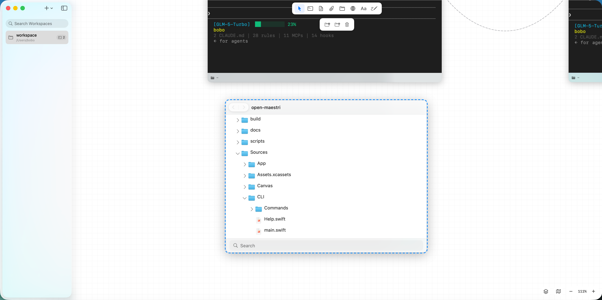

<p align="center">
  
</p>

<h1 align="center">open-maestri</h1>

<p align="center">
  <strong>Open-source multi-agent orchestration canvas for macOS</strong>
  <br>
  Manage AI agents like a team, not a terminal.
  <br><br>
  <a href="README-zh.md">中文</a> | <strong>English</strong>
</p>

<p align="center">
  <a href="https://github.com/zlh-428/open-maestri/releases/latest"></a>
  <a href="https://github.com/zlh-428/open-maestri/stargazers"></a>
  <a href="LICENSE"></a>
  
  <a href="https://img.shields.io/badge/swift-5.9-orange?style=flat-square" alt="Swift 5.9"></a>
  <a href="https://github.com/zlh-428/open-maestri/actions"></a>
</p>

<p align="center">
  <a href="#installation">Download</a> ·
  <a href="#quick-start">Quick Start</a> ·
  <a href="#omaestri-cli">CLI Reference</a> ·
  <a href="docs/roadmap.md">Roadmap</a> ·
  <a href="CONTRIBUTING.md">Contributing</a>
</p>

<p align="center">
  
</p>

---

## What is open-maestri?

open-maestri is a **canvas-based orchestration layer** for the Agentic AI era. It is not an AI agent itself — it is the workspace that surrounds and coordinates them.

Place terminals, AI agents, Markdown notes, file browsers, and embedded browsers together on an infinite spatial canvas. Connect them with physics-based rope animations. Let agents communicate directly through the `omaestri` CLI without you acting as a human router.

**Core pain point:** When running multiple AI coding agents (Claude Code, Codex CLI, Gemini CLI, etc.) simultaneously, developers are forced to manually shuttle context between terminal windows. open-maestri eliminates that friction.

## Why open-maestri?

| | open-maestri | Maestri |
|---|---|---|
| License | **GPL v3** (free forever, open) | Proprietary (SetApp) |
| macOS requirement | **14.0+ (Sonoma)** | macOS 26.2+ |
| Source available | Yes | No |
| Data format | Fully compatible | Maestri native |
| CLI compatible | Yes (`omaestri` = `maestri`) | Yes |
| Skill ecosystem | Open, extensible | Closed |

## Key Features

<details>
<summary><strong>Infinite Canvas</strong></summary>

- Drag and drop Terminal, Note, File Tree, Portal, and Text nodes onto an infinite canvas
- Pan and zoom with trackpad gestures or mouse scroll
- Physics-based rope animations for connections (catenary curve, 21 control points)
- Minimap for quick navigation

</details>

<details>
<summary><strong>Terminal & Agent Nodes</strong></summary>

- Full VT100/xterm-256color interactive PTY via [SwiftTerm](https://github.com/migueldeicaza/SwiftTerm)
- Built-in agent presets: Claude Code, Codex CLI, Gemini CLI, OpenCode, Shell
- Agent status indicator (running / idle)
- Scrollback history persisted across restarts



</details>

<details>
<summary><strong>Inter-Agent Communication</strong></summary>

Agents communicate via the `omaestri` CLI, automatically injected when terminals are connected:

```bash
omaestri list                          # List connected agents, notes, portals
omaestri ask "Reviewer" "Review my PR" # Send message and wait for response
omaestri check "Builder"               # Read target agent's current output
omaestri note read "Spec"              # Read a connected Note
omaestri note write "Spec" "content"   # Write to a Note
```



</details>

<details>
<summary><strong>Maestro Mode</strong></summary>

One agent acts as the team lead — recruiting, connecting, and dismissing agents programmatically:

```bash
omaestri recruit "Builder" --preset claude-code --role coder
omaestri connect "Builder" "Spec"
omaestri dismiss "Builder"
```

</details>

<details>
<summary><strong>Note Nodes</strong></summary>

- Raw (Markdown edit) and Formatted (live preview) dual-view
- Paste images directly into notes
- Note chains: connect notes to notes, agents traverse the entire chain
- Import `.md` / `.txt` files by dragging from Finder

</details>

<details>
<summary><strong>Portal (Embedded Browser)</strong></summary>

- WKWebView in a canvas node
- Agent-controlled browser automation via `omaestri portal` commands:

```bash
omaestri portal navigate "Browser" "http://localhost:3000"
omaestri portal snapshot "Browser"   # accessibility tree
omaestri portal click "Browser" @e3
omaestri portal fill "Browser" @e1 "admin"
```

</details>

<details>
<summary><strong>Workspace Persistence</strong></summary>

- Full canvas layout (positions, sizes, connections) restored on restart
- Auto-save every 30 seconds (background thread, no UI blocking)
- Crash recovery via `cleanShutdown` flag
- Compatible with **Maestri v0.25.4** `workspace.json` format

</details>

## Screenshots

| | |
|:---:|:---:|
|  |  |
|  |  |

---

## Installation

### Download (Recommended)

Download the latest signed `.dmg` from [GitHub Releases](https://github.com/zlh-428/open-maestri/releases).

### Quick Start (Build from Source)

```bash
git clone https://github.com/zlh-428/open-maestri.git
cd open-maestri
open Package.swift   # Opens in Xcode — hit Run
```

### Build with Swift Package Manager

```bash
swift build -c release
```

### Build with Xcode (CI-compatible)

```bash
xcodebuild \
  -scheme open-maestri \
  -destination 'platform=macOS' \
  build \
  CODE_SIGN_IDENTITY="" \
  CODE_SIGNING_REQUIRED=NO
```

> **Requirements**: macOS 14.0+ (Sonoma), Xcode 16+, Swift 5.9+

## How It Works

```
Canvas (NSView infinite viewport)
  ├─ Terminal Node (SwiftTerm PTY) ← omaestri CLI injected
  ├─ Note Node (Markdown)
  ├─ File Tree Node
  ├─ Portal Node (WKWebView)
  └─ Connection (physics-based rope)
        ↕ IPC
InterAgentServer (127.0.0.1, HTTP POST /cli)
        ↕ omaestri CLI
Agents talk to each other directly — you stay in the flow
```

## omaestri CLI

The `omaestri` script is automatically injected into connected terminals. It communicates with the app via a local HTTP server (`127.0.0.1` only).

| Command | Description |
|---------|-------------|
| `omaestri list` | List connected agents, notes, portals |
| `omaestri ask "Name" "prompt"` | Send message, wait for response |
| `omaestri check "Name"` | Read target agent's terminal output |
| `omaestri note create "Name"` | Create a new note |
| `omaestri note read "Name" [--offset N] [--limit N]` | Read note content |
| `omaestri note write "Name" "content"` | Write to note |
| `omaestri recruit "Name" [--preset P] [--role R]` | Spawn new agent (Maestro only) |
| `omaestri dismiss "Name"` | Close and remove agent (Maestro only) |
| `omaestri connect "From" "To"` | Connect two nodes (Maestro only) |
| `omaestri portal navigate "Name" "url"` | Navigate portal to URL |
| `omaestri portal snapshot "Name"` | Get accessibility tree |
| `omaestri portal click "Name" @ref` | Click element |
| `omaestri portal fill "Name" @ref "value"` | Fill input field |

## Compatibility

open-maestri maintains full compatibility with Maestri v0.25.4:

- **workspace.json** (`schemaVersion: 2`): read and write compatible
- **omaestri CLI**: identical command interface to `maestri` CLI
- **Agent Skills**: existing Maestri Skill scripts work without modification

## Project Structure

```
open-maestri/
├── Sources/                    # Swift source code
│   ├── App/                    # App lifecycle, window management
│   ├── Canvas/                 # Infinite canvas rendering (NSView)
│   ├── Connection/             # Rope physics and connection logic
│   ├── Terminal/               # PTY terminal nodes (SwiftTerm)
│   ├── Note/                   # Markdown note nodes
│   ├── InterAgent/             # omaestri CLI HTTP server
│   ├── Workspace/              # Persistence, serialization
│   ├── Settings/               # Preferences UI
│   ├── Portal/                 # WKWebView browser nodes
│   ├── FileTree/               # File browser nodes
│   ├── Floor/                  # Git worktree branch isolation
│   ├── Routine/                # Scheduled task automation
│   ├── SSH/                    # Remote SSH tunnel support
│   ├── Maestro/                # Maestro orchestration mode
│   ├── Roles/                  # Agent role system
│   ├── Spotlight/              # macOS CoreSpotlight integration
│   ├── Shared/                 # Shared utilities and models
│   └── OpenMaestriApp.swift    # App entry point
├── Tests/                      # Unit and integration tests
├── Package.swift               # Swift Package Manager manifest
├── .github/workflows/          # GitHub Actions CI
└── LICENSE                     # GPL v3.0
```

## Contributing

Contributions are welcome. Please read the [contributing guidelines](CONTRIBUTING.md) before submitting a PR.

```bash
swift test
```

**Areas actively seeking contributors:**

- Portal browser automation commands
- File Tree git operations
- Floors (git worktree integration)
- Routines (scheduled task scheduler)
- Remote SSH support
- Linux / Windows ports (long term)

---

## Star History

<a href="https://star-history.com/#zlh-428/open-maestri&Date">
 <picture>
   <source media="(prefers-color-scheme: dark)" srcset="https://api.star-history.com/svg?repos=zlh-428/open-maestri&type=Date&theme=dark" />
   <source media="(prefers-color-scheme: light)" srcset="https://api.star-history.com/svg?repos=zlh-428/open-maestri&type=Date" />
   
 </picture>
</a>

## Contributors

<a href="https://github.com/zlh-428/open-maestri/graphs/contributors">
  
</a>

---

## Acknowledgments

- [SwiftTerm](https://github.com/migueldeicaza/SwiftTerm) — terminal emulation
- [Sparkle](https://github.com/sparkle-project/Sparkle) — auto-update framework
- [Maestri](https://maestriapp.com) — the original product that inspired this open-source reimplementation

## License

[GPL v3](LICENSE)
